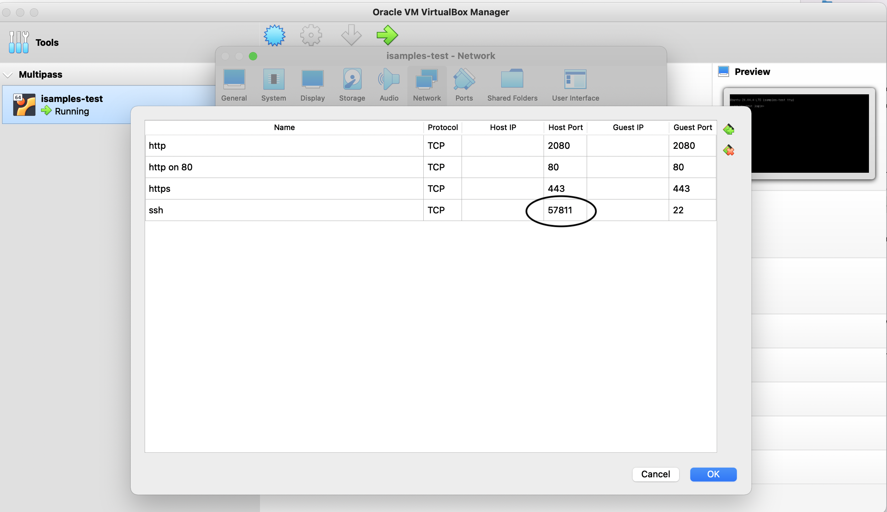
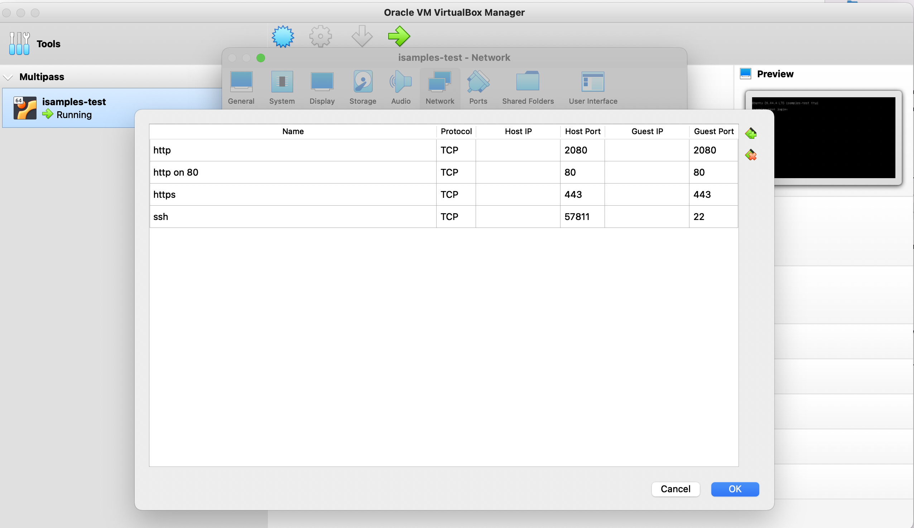

# isamples-ansible
Repository for iSamples [Ansible](https://docs.ansible.com) scripts.  As of this writing, there are two main Ansible playbooks, one for deploying iSamples to existing servers and one for configuring the iSamples software stack on a new server.

## Configuring the iSamples ansible python virtual environment
Ansible is based on python, and python is best managed by using virtual environments.  iSamples manages its python dependencies using [poetry](https://python-poetry.org), so it's assumed you have that installed and know how to use python virtual environments.
Step by step:
* Create a virtualenv:
`mkvirtualenv isamples-ansible`
* Or if the virtualenv already exists:
`workon isamples-ansible`
* Install dependencies using poetry
`poetry install`
* Open a poetry shell
`poetry shell`
* Make sure it works:
`ansible all -m ping --ask-pass`

## Deploying iSamples releases to an existing server
The first ansible playbook is used to push iSamples releases to one or more existing servers.  The list of server groups to deploy to is contained in the `hosts` [inventory](https://docs.ansible.com/ansible/2.5/user_guide/intro_inventory.html) file.

### Tagging for development servers

Before you run the Ansible playbook, you'll want to make a new tag, as we only deploy iSamples tags to dev off the develop branch using a custom tagger script.

* Have your iSamples Docker git repo checked out with all the submodules somewhere, then use that directory as the path argument to the python tagger script:
`python create_release_tag.py <PATH>`

When you run this, it will update the ansible `group_vars/dev` file with the latest tag.  Ansible reads this to know which tag to check on the dev server.

### Making and pushing a release tag

After you've deployed the new tag to `dev` and you're happy that it works, you'll want to promote the dev tag to an official release.  Similar to the tagging process for dev,
you'll want to run a different script on the same local checkout:

* Make sure you've activated the virtual environment running and run `python publish_main_tag.py <PATH>`.  By default, it will promote the last release tag, 
but you can also specify a specific one using the `--source_tag` argument.

### Pushing a release to a host group:
After you've made a new tag, you can push it to one of the host groups by running the `site.yml` Ansible playbook.

* The host groups are defined in the `hosts` file, and you can specify the group under the limit parameter e.g.:
`ansible-playbook site.yml -i hosts -u <ssh_user> -K --limit 'isc'`
In that example, we chose the `isc` group, which will push to the iSamples Central host group.  The options are as follows:
  * *-i* specifies the inventory file to use
  * *-u* specifies the ssh user for the remote host (Ansible runs all communication over ssh)
  * *-K* specifies to prompt for the credentials on the command-line.  The deploy script runs many tasks as root via `sudo`, so the ssh user will need sudo privileges.
  * *--limit 'isc'* specifies to limit the host inventory to the `isc` host group
* References:  
  * https://docs.ansible.com/ansible/latest/user_guide/intro_inventory.html
  * https://docs.ansible.com/ansible/latest/user_guide/intro_patterns.html

### Host dependencies:
* The directory where we check out the project may need to have been manually initialized with git lfs (mars needed manual intervention, hyde did not)
* `sudo apt install acl/focal` -- the acl package is required for ansible to function properly on the remote host

## Configuring a new iSamples host on AWS
* Create EC2 instance
	* Create elastic IP, and *assign* it to the ec2 instance you just created.  Those are two distinct steps!
	* Create security group to allow http and https traffic (https://aws.amazon.com/premiumsupport/knowledge-center/connect-http-https-ec2/)
* Run all commands us ubuntu user you get out of the box with ec2.  ssh by using the `.pem` file per the instructions in the ec2 console.
* Manually copy the model files into place (they aren't checked into git) at `/var/local/data/models`
  * You can rsync them from mars.cyverse.org: `rsync -avz -e 'ssh -p 1657' dannymandel@mars.cyverse.org:/var/local/data/models/ /var/local/data/models/`
	* Manually create a docker volume for the models `docker volume create metadata_models`
	* Copy all the models into the docker volume after the instance is brought up for the first time: `sudo docker cp /var/local/data/models/OPENCONTEXT_material_config.json isamples_inabox-isamples_inabox-1:/app/metadata_models`
* Checkout the isamples-ansible repo: `git clone https://github.com/isamplesorg/isamples-ansible.git`
* `poetry install` then `poetry shell` to get the python environment with all the poetry dependencies available
* Set up the URLs to work properly on the new instance:
	* Register DNS to point at elastic IP (https://dns.he.net)
	* Make local changes for various bits of config for the ansible settings
	  * In the ansible repo, you need to change the hostname variable in group_vars/all, e.g. `hostname: iscaws.isample.xyz`
		* In the ansible repo, the built-in `systemd` service name is `isamples_inabox`, e.g.: `services: [isamples_inabox]`
		* In the ansible repo, you need to add your email for certbot registration in group_vars/all, e.g. `certbot_email: danny.mandel@gmail.com`
		* In the ansible repo, you *may* need to change the redirect URL in `isamples-ina-box-nginx.j2`.  By default, it redirects all `nginx` requests to `<hostname>/isamples_inabox`.  Note that when you get to the Docker config there is a separate bit of config for this and the Docker config will need to match what you choose in this step.  The lines in the nginx config look like this: 
			```
    location /isamples_inabox/ {
    rewrite /isamples_inabox/(.*)  /$1  break;			
			```  Make sure this matches up with whatever URL pattern you want to use for your instance.
* `ansible-playbook configure_isamples_server.yml -i hosts --limit 'localhost'` -- this will fail the first time because the secrets don't exist and various bits of Docker config need to be edited.
* Manually create the secrets directory inside the git checkout: `cd /home/isamples/isamples_inabox && mkdir secrets && cd secrets && nano <secret_name>`
* `ansible-playbook configure_isamples_server.yml -i hosts --limit 'localhost'` -- should work this time because you manually created the secrets
* If you need to debug why docker isn't starting: `sudo su - isamples; cd /home/isamples/isamples_inabox; docker compose --env-file .env.isamples_central up -d --build
	* Note that the nginx config needs to match the paths specified in the isamples environment file you specify in the docker command.  This is an easy way to get things out of whack.
* Manually dump the database on a known good instance: `pg_dump --data-only --dbname="isb_1" --host="localhost" --port=5432 --username=isb_writer > ./isamples.SQL`
* Load that database back up on the new instance: `psql -U isb_writer -d isb_1 -f isamples.SQL`
* Run the solr indexer in the iSB container:
	* `docker exec -it isamples_inabox-isamples_inabox-1 bash`
		* export PYTHONPATH=/app
		* `python scripts/smithsonian_things.py --config ./isb.cfg populate_isb_core_solr`
		
	
###
Things that were broken when I was configuring the new host:
* Ansible group_vars had the wrong tag so we deployed an old incorrect version of things
* The ansible playbook had things configured to use `isamples_inabox` instead of `isamples_central`
* Various minor changes needed to be made to the playbook to get it to point at a localhost instead of a VM:
```
ubuntu@ip-172-31-86-122:~/isamples-ansible$ git diff
diff --git a/configure_isamples_server.yml b/configure_isamples_server.yml
index 654023b..67c99b3 100644
--- a/configure_isamples_server.yml
+++ b/configure_isamples_server.yml
@@ -1,6 +1,7 @@
 ---
 - name: Configure an iSamples Development server
-  hosts: all
+  hosts: localhost
+  connection: local
   become: yes
   
   tasks:
@@ -99,4 +100,4 @@
   - name: Reload systemd
     systemd:
       daemon-reload: yes
-    become: yes
\ No newline at end of file
+    become: yes
diff --git a/group_vars/all b/group_vars/all
index 46521e9..4a02c4f 100644
--- a/group_vars/all
+++ b/group_vars/all
@@ -1,2 +1,5 @@
 ansible_port: 1657
-latest_tag: ISAMPLES-63
+latest_tag: ISAMPLES-68
+services: [isamples_inabox]
+hostname: iscaws.isample.xyz
+certbot_email: danny.mandel@gmail.com
diff --git a/hosts b/hosts
index e7de9aa..01a930d 100644
--- a/hosts
+++ b/hosts
@@ -1,3 +1,6 @@
+[localhost]
+localhost
+
```

## Configuring a new iSamples host with a virtual machine
The other ansible playbook is used to configure a new iSamples host with all the host dependencies.  These instructions assume a virtual machine created and running on a local Mac, but there's no reason this ansible playbook couldn't be run against a remote linux server anywhere.

### A note on templates
There are files checked into the repository with the `.template` extension.  These files must be copied to another file in the same location on the filesystem with the `.template` extension omitted, e.g.
`cp cloud-init.yaml.template cloud-init.yaml`
After you copy the file, open it with your favorite text editor and customize before running the playbook.  There are three such files in this repository:

* `cloud-init.yaml.template` -- specifies details for virtual machine creation, mainly account credentials on the virtual machine
* `group_vars/virtual_machines.template` -- specifies details for the https setup with certbot.  You'll need to have configured DNS beforehand, and ensure that port 80 of the IP that resolves the DNS is open for traffic and responding before running certbot.
* `multipass-hosts.yml.template` -- specifies details about where the virtual machine is located and which ssh account should be used to hit the VM

### Setting up a multipass VM for ansible to run against
Multipass is a very handy program for installing and configuring a Linux VM on a Mac host.  You can read about multipass here: https://multipass.run

* Install multipass: `brew install --cask multipass`
* Copy the `cloud-init.yaml.template` file to `cloud-init.yaml`, then insert your user account name, public key, and plaintext password contents into the file.
* Create a test VM: `multipass launch --name isamples-test --cloud-init cloud-init.yaml --disk 20G --mem 8G`.  Tweak parameters accordingly, but those settings do allow the iSamples software stack to come up as of 3/16/22.
* To verify the VM is working as expected, ssh to the VM by using the IP address -- you can obtain it by running `multipass info isamples-test` (or by looking at localhost if you're running with VirtualBox) 
* Copy `multipass-hosts.yml.template` to `multipass-hosts.yml` and insert the relevant values.
* Verify you can ping the host with ansible: `ansible -i ./multipass-hosts.yml isamplesvm -m ping`
* Run the host configuration playbook: `ansible-playbook configure_isamples_server.yml -i ./multipass-hosts.yml -K`

### Virtualbox for port forwarding
In order to get port forwarding to work on the Mac, you need to install [virtualbox](https://www.virtualbox.org) and tell multipass to use it for networking.

* `sudo multipass set local.driver=virtualbox`
* You can then configure port forwarding as described on this page: https://multipass.run/docs/using-virtualbox-in-multipass-macos
* Note that you won't get a standard IP address the way you do with hyperkit -- you'll need to launch VirtualBox, see which port is forwarded, and include that port in `multipass-hosts.yml`.  Since the port is forwarded, you can just set the host to localhost. 

### Copying metadata models to the target server
Due to the large size, the metadata models(that are finetuned BERT models) are not possible to be uploaded in the `isamples_inabox` repository. In order to solve this problem, we need to have the ansible playbook to manually copy the metadata models inside the target server. We have our `roles/common/tasks/main.yml` doing this for us.<br>

* Download and unzip the metadata model folder into `/data/isamples/metadata_models` of the machine that you will run the ansible playbook (or, you can change the `src` value of the `ansible.builtin.copy` command). 
* Run the ansible playbook, which will allow the `/data/isamples/metadata_models` copied into the `/home/isamples/isamples_inabox/isb/metadata_models` of the target server.